# Лабораторная работа №2

## Ознакомление с руководством программы udev

```bash
  `man udev
```

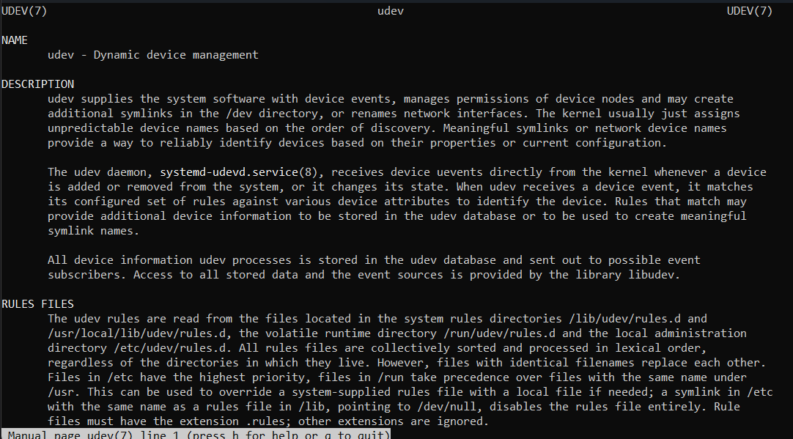

## Ознакомление с возможностями утилиты udevadm

* Это утилита для управления подсистемой `udev` в Linux: она показывает информацию об устройствах, отслеживает события подключения/отключения, перезагружает правила и помогает отлаживать работу с оборудованием.

```bash
  man udevadm
```

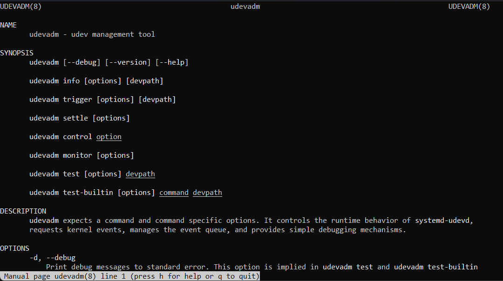

```bash
  udevadm --help
```

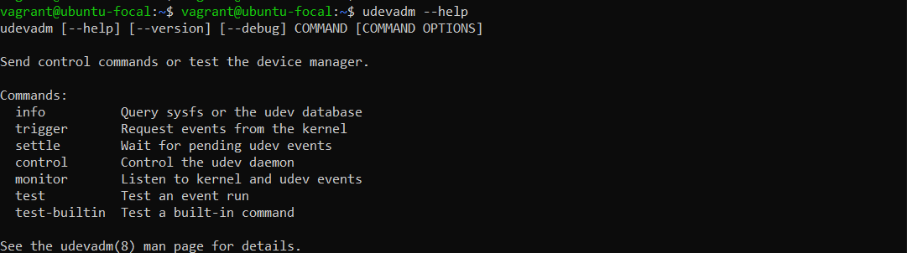

## `sudo udevadm monitor`

### Команда `sudo udevadm monitor` предназначена для наблюдения за событиями устройств в режиме реального времени и их записи в лог. Она позволяет отслеживать как исходные (сырые) события, поступающие от ядра, так и события, уже прошедшие обработку в подсистеме `udev`.

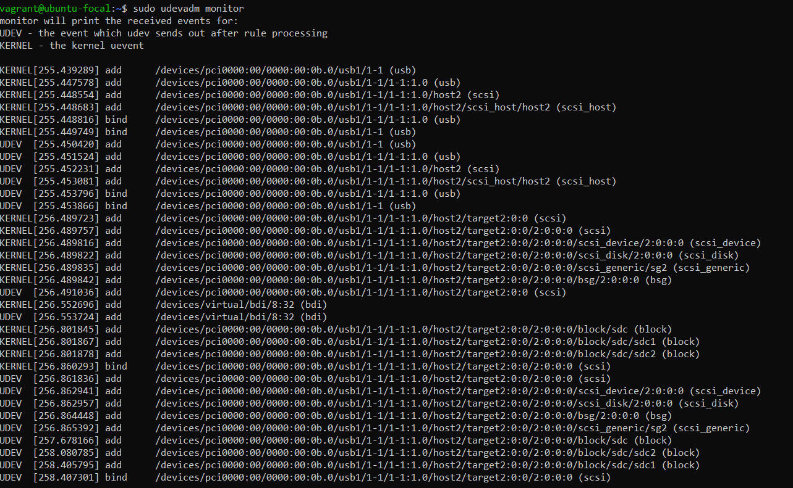   

### Сначала ядро фиксирует физическое подключение USB-устройства к порту 1-1.

```bash
  KERNEL[255.439289] add /devices/pci0000:00/0000:00:0b.0/usb1/1-1 (usb)
```

* Ядро увидело новое USB-устройство на шине usb1, порт 1-1 **

### Затем загружается модуль `usb-storage`, и `udev` связывает устройство с подсистемой хранения данных Linux. 

```bash
  KERNEL[255.448554] add /devices/pci0000:00/0000:00:0b.0/usb1/1-1/1-1:1.0/host2 (scsi)
  KERNEL[255.448683] add /devices/pci0000:00/0000:00:0b.0/usb1/1-1/1-1:1.0/host2/scsi_host/host2 (scsi_host)
  KERNEL[255.449749] bind /devices/pci0000:00/0000:00:0b.0/usb1/1-1 (usb)
```

* Драйвер `usb-storage` привязывается к интерфейсу 1-1:1.0 и регистрирует устройство как часть подсистемы хранения.
  
### Создаётся виртуальный `SCSI-хост` (host2), после чего определяется точный адрес шины, канала и устройства. 

```bash
  KERNEL[255.489723] add /devices/pci0000:00/0000:00:0b.0/usb1/1-1/1-1:1.0/host2/target2:0:0 (scsi)
  KERNEL[255.489816] add /devices/pci0000:00/0000:00:0b.0/usb1/1-1/1-1:1.0/host2/target2:0:0/2:0:0:0 (scsi)
```

* Появляется `SCSI-таргет` target2:0:0 и конкретное `SCSI-устройство` 2:0:0:0 (шина 2, канал 0, target 0, LUN 0).
  
### Далее инициализируется дисковая подсистема и формируются блочные устройства вместе с разделами. 

```bash
  UDEV [256.552696] add /devices/virtual/bdi/8:32 (bdi)

  KERNEL[256.801845] add /devices/pci0000:00/0000:00:0b.0/usb1/1-1/1-1:1.0/host2/target2:0:0/2:0:0:0/block/sdc (block)
  KERNEL[256.801867] add /devices/pci0000:00/0000:00:0b.0/usb1/1-1/1-1:1.0/host2/target2:0:0/2:0:0:0/block/sdc/sdc1 (block)
  KERNEL[256.801878] add /devices/pci0000:00/0000:00:0b.0/usb1/1-1/1-1:1.0/host2/target2:0:0/2:0:0:0/block/sdc/sdc2 (block)
```

* Создаётся BDI (Backing Device Info) — подсистема кэша и очередей ввода-вывода для будущего блочного устройства. Ядро создаёт блочное устройство `/dev/sdc` и его разделы `/dev/sdc1` и `/dev/sdc2`.
  
### В конце видим под каким именем подключилась наша флешка - `sdc`, с разделами `sdc1` и `sdc2`. 

```bash
  UDEV [256.861836] add /devices/pci0000:00/0000:00:0b.0/usb1/1-1/1-1:1.0/host2/target2:0:0/2:0:0:0/block/sdc (block)
  UDEV [258.407301] bind /devices/pci0000:00/0000:00:0b.0/usb1/1-1/1-1:1.0/host2/target2:0:0/2:0:0:0 (scsi)
```

* `udev` завершает обработку: устройство полностью зарегистрировано и готово к использованию как `sdc`, `sdc1`, `sdc2`.

### Также можем узнать имя устройства через `fdisk –l`

```bash
  sudo fdisk –l
```

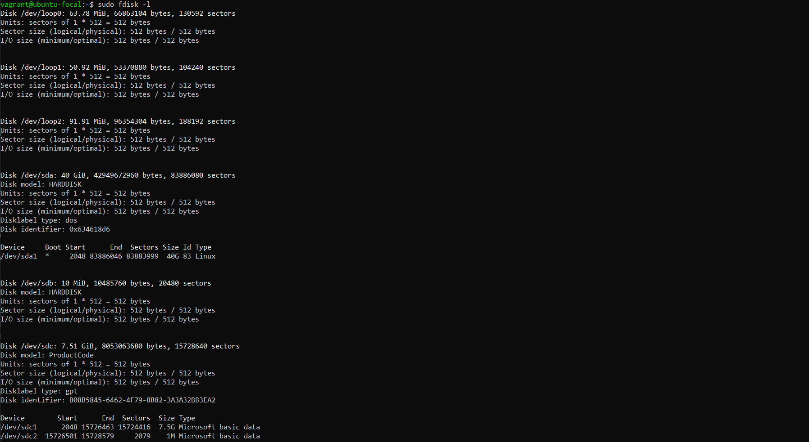

## Получаем информацию об устройстве

```bash
  sudo udevadm info --query=all --name=/dev/sdc1
```

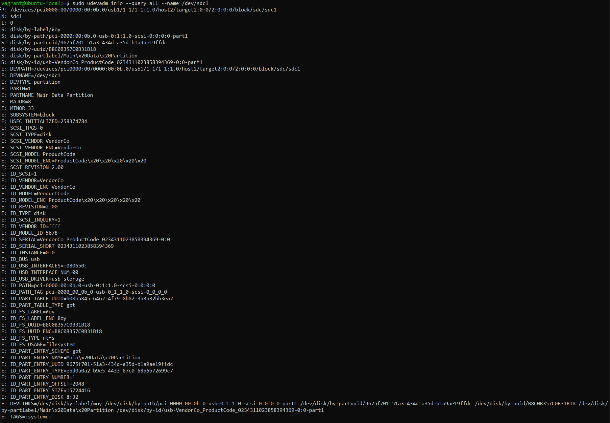

## Ознакомление с системными правилами udev

```bash
  cd /lib/udev/rules.d
  ls -l
  less 60-persistent-storage.rules
```

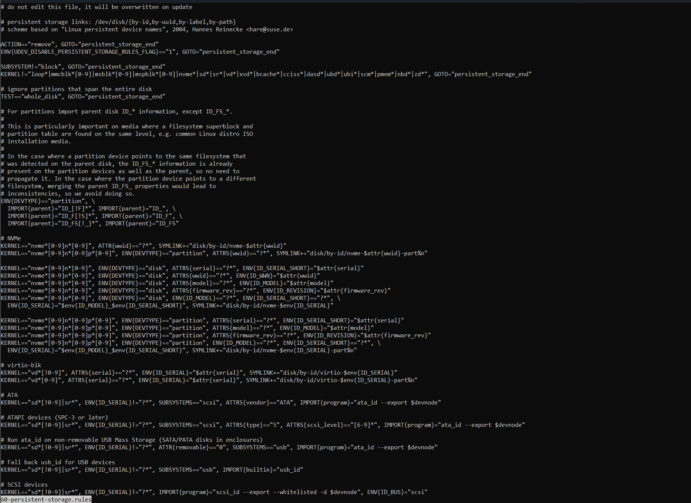

## Создание пользовательского правила

```bash
  cd /etc/udev/rules.d
  sudo nano 91-myrule.rules
```


* Вставляем в файл

```bash
  KERNEL=="sdc", ACTION=="add", RUN+="/bin/mkdir /home/vagrant/new_dir"
```  

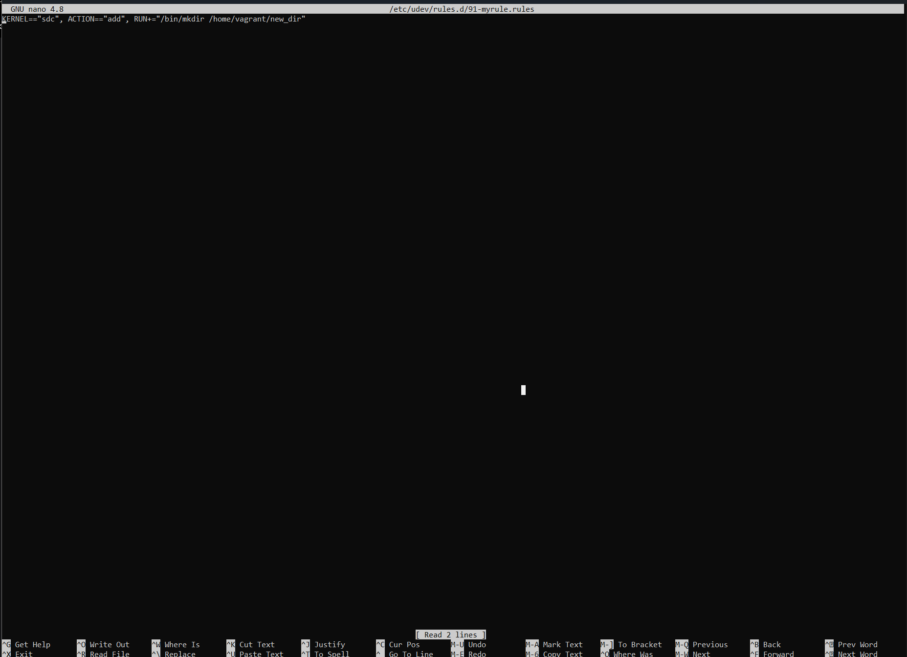

## Перезагрузка правил и проверка

```bash
  sudo udevadm control --reload-rules
```

* Отключаем и снова подключаем носитель.
* Вводим команду для проверки
  
```bash
  ls -l /home/vagrant/new_dir
```


## Добавление нового правила

```bash
  sudo nano /etc/udev/rules.d/92-nerule.rules
```

* Вставляем в файл

```bash
  KERNEL=="sdc", ACTION=="add", RUN+="/bin/sh -c 'echo inserted >> /home/vagrant/udev.log'"
  KERNEL=="sdc", ACTION=="remove", RUN+="/bin/sh -c 'echo removed >> /home/vagrant/udev.log'"
```  

## Перезагрузка правил и проверка

```bash
  sudo udevadm control --reload-rules
```

* Отключаем и снова подключаем носитель.
* Вводим команду для проверки
  
```bash
  cat /home/vagrant/udev.log
```

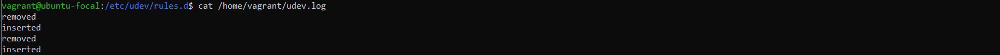

### Ознакомление с утилитами modprobe, lsmod, modinfo

```bash
  # загрузка и выгрузка модулей ядра
  man modprobe

  # список загруженных модулей ядра
  man lsmod

  # информация о модуле ядра
  man modinfo
```

* modprobe - утилита для загрузки и выгрузки модулей ядра с автоматическим разрешением зависимостей. Используется для подключения драйверов устройств и файловых систем.
* lsmod - утилита для отображения списка модулей, загруженных в ядро в данный момент. Применяется для диагностики и проверки результата загрузки.
* modinfo - утилита для вывода информации о модуле ядра: автор, лицензия, зависимости, параметры загрузки, путь к файлу. Работает как с загруженными, так и с незагруженными модулями.

## Список загруженных модулей ядра

```bash
  lsmod
```

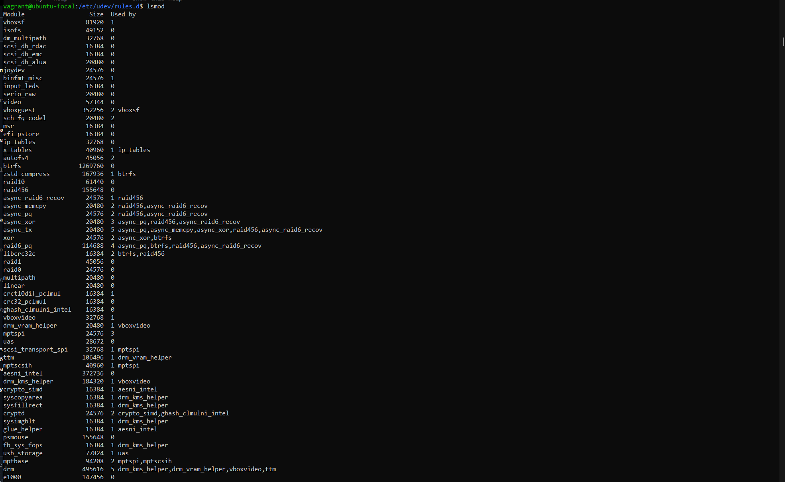

## Выбераем модуль loop из полученного ранее списка и выводим информацию о нем с помощью modinfo.

```bash
  modinfo loop
```

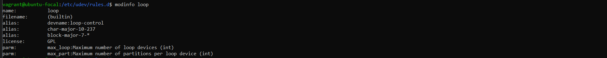

## Загрузка модуля из /lib/modules и проверка

```bash
  # Посмотр доступных модулей
  find /lib/modules/$(uname -r) -name "*.ko*" | head
  
  # Проверка, что модуль ещё не загружен
  lsmod | grep msdos
  
  # Проверка есть ли модуль в системе
  find /lib/modules/$(uname -r) -name "msdos.ko*"

  # Загрузка модуля
  sudo modprobe msdos

  # Проверка, что он загружен
  lsmod | grep msdos
```

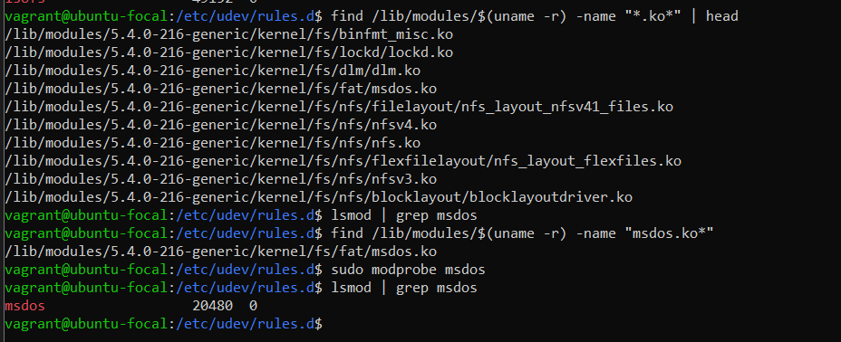
