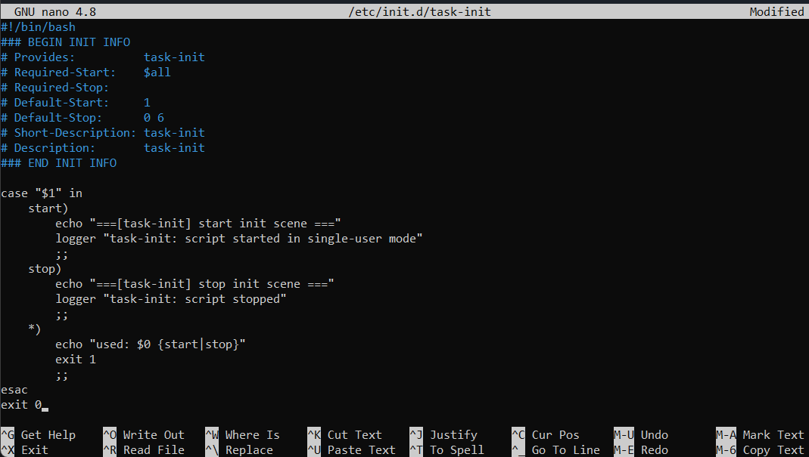
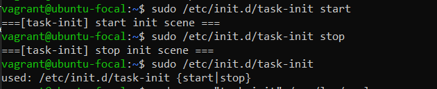
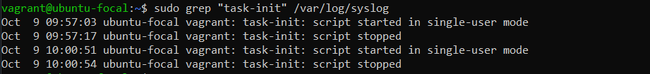
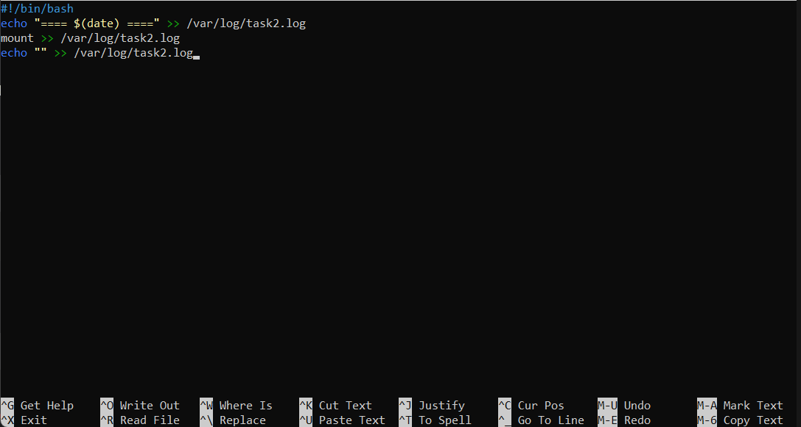
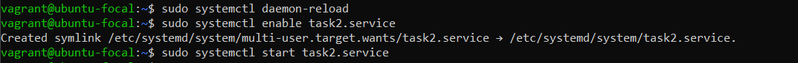
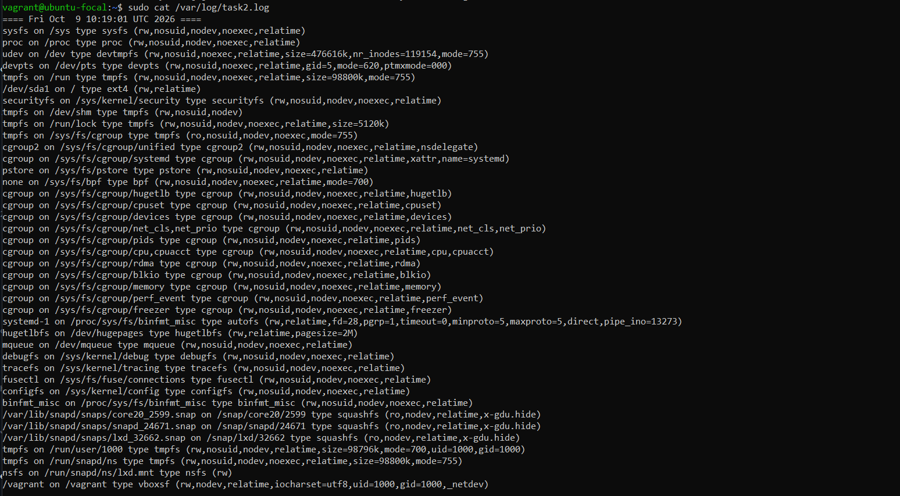
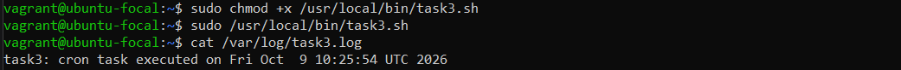
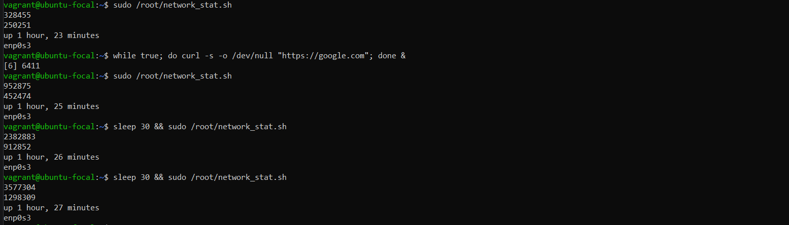

# Лабораторная работа №3

## Часть 1

### Задание 1

#### Написать стартовый сценарий, который запускается последним при переходе на режим выполнения в однопользовательском режиме. Стартовый сценарий обязан поддерживать параметры остановки и запуска.

* Создаем файл скрипта

```bash
  sudo nano /etc/init.d/task-init
```

* Содержание нашего скрипта


  
  * `Provides: task-init` - уникальное имя скрипта.
  
  * `Required-Start: $all` - скрипт запускается последним.
  
  * `Default-Start: 1` - запуск в однопользовательском режиме.
  
  * `Default-Stop: 0 6` - остановка при выключении (0) и перезагрузке (6).

* Даем права на запуск и регистрацию

  ```bash
    sudo chmod +x /etc/init.d/task-init
    sudo update-rc.d task-init defaults
  ```

* Проверяем работу скрипта с параметрами остановки и запуска, а также проверяем логи:

  

  

### Задание 2

#### В среде, содержащей систему systemd, описать новый тестовый системный юнит, который запускается после монтирования всех файловых систем и сохраняет список смонтированных систем и время в файл журнала.

* Создаем файл скрипта

  ```bash
    sudo nano /usr/local/bin/task2.sh
  ```

* Содержание нашего скрипта

  ```bash
    #!/bin/bash
    echo "==== $(date) ====" >> /var/log/task2.log
    mount >> /var/log/task2.log
    echo "" >> /var/log/task2.log
  ```

  

* Даем права на запуск

  ```bash
    sudo chmod +x /usr/local/bin/task2.sh
  ```

* Создаём systemd-юнит

  ```bash
    sudo nano /etc/systemd/system/task2.service
  ```

* Содержание 

  ```bash
    [Unit]
    Description=Task2 - save mounted filesystems to log
    After=local-fs.target #запуск после монтирования всех локальных файловых систем 
    
    [Service]
    Type=oneshot #скрипт выполняется один раз и завершается
    ExecStart=/usr/local/bin/task2.sh
    
    [Install]
    WantedBy=multi-user.target #включается в обычной загрузке
  ```

* Активируем юнит через специальные команды

    

    * `sudo systemctl daemon-reload` - перечитываем конфигурацию systemd
    * `sudo systemctl enable task2.service` - включаем автозапуск
    * `sudo systemctl start task2.service` - запускаем прямо сейчас
   
* Смотрим лог-файл

    

### Задание 3

#### Создать тестовый скрипт и обеспечить его выполнения по расписанию каждую пятницу 2 недели каждого месяца в 01 часов 12 минут.

* Создаем файл скрипта

  ```bash
    sudo nano /usr/local/bin/task3.sh
  ```

* Содержимое

  ```bash
    #!/bin/bash
    echo "task3: cron task executed on $(date)" >> /var/log/task3.log
  ```

* Даем права на запуск, проверяем, что все работает, запустив в ручную

  

* Настройка расписания через `/etc/cron.d/`

  * Создаем файл

    ```bash
      sudo nano /etc/cron.d/task3
    ```

  * Содержимое

     ```bash
        # Task3: run every Friday of the 2nd week of the month at 01:12
        12 01 8-14 * * root [ "$(date '+\%u')" -eq 5 ] && /usr/local/bin/task3.sh
      ```

  * Даем правильные права
 
    ```bash
      sudo chmod 644 /etc/cron.d/task3
    ```

    * Cron игнорирует файлы в /etc/cron.d/, у которых есть права на запись у группы или остальных. 644 нужно для того, чтобы обычный пользователь не подсунул задачу от имени root.

## Часть 2

### Задание 1

#### Написать скрипт для сбора статистики с интерфейса. Обеспечить его постоянной загрузкой активностью: скачивание файла и т.п.

* Сначала создаем скрипт и даем права
  
    ```bash
      sudo nano /root/network_stat.sh
      sudo chmod +x /root/network_stat.sh
    ```

* Код самого скрипта

  ```bash
          #!/bin/bash                           
          INTERFACE="enp0s3"                    
          RX=$(grep "$INTERFACE" /proc/net/dev | awk '{print $2}')    # получаем кол-во принятых байт
          TX=$(grep "$INTERFACE" /proc/net/dev | awk '{print $10}')   # получаем кол-во переданных байт
          UPTIME=$(uptime -p)

          #вывод                     
          echo "$RX"                              
          echo "$TX"                              
          echo "$UPTIME"                          
          echo "$INTERFACE"                    
    ```

* Проверяем работу скрипта, cоздаем постоянную сетевую нагрузку через google.com и через sleep смотрим, как меняются счетчики со временем

  

* Остановка загрузки

  ```bash
      pkill -f "curl -s -o /dev/null"
    ```

### Задание 2-3

#### Обеспечить сбор данных для формирования графика активности с использованием утилиты `mrtg`. Сформировать график сетевой активности.

* Будем использовать ранее созданный вспомогательный скрипт `network_statistic.sh` разместив его по пути `/root/network_statistic.sh`. Для начала установим устанавливаем сам `mrtg` все необходимые зависимости для работы.

    ```bash
      sudo apt install mrtg -y
      sudo apt update
      sudo apt install apache2 -y
      sudo apt install snmp snmpd -y
      sudo systemctl restart snmpd
      sudo systemctl enable snmpd
    ```

* Создаём рабочую директорию для `mrtg`

    ```bash
      sudo mkdir -p /var/www/html/mrtg
      sudo chown -R www-data:www-data /var/www/html/mrtg
    ```

* Открываем файл
  
  ```bash
    sudo nano /etc/mrtg.cfg
  ```
  
* Настраиваем конфиг `mrtg` по пути `/etc/mrtg.cfg`

    ```bash
      WriteExpires: Yes
      Refresh: 300 #автообновление страницы каждые 300 сек
      
      WithPeak[_]: wym
      Suppress[_]: y
      
      Target[enp0s3]: `/root/network_stat.sh`
      WorkDir: /var/www/html/mrtg
      
      Options[enp0s3]: growright
      Title[enp0s3]: enp0s3 Traffic Analysis
      PageTop[enp0s3]: <h1>enp0s3 Traffic</h1>
      MaxBytes[enp0s3]: 12500000
      kilo[enp0s3]: 1024
      
      YLegend[enp0s3]: Bytes per Second
      ShortLegend[enp0s3]: b/s
      LegendI[enp0s3]: In Traffic:
      LegendO[enp0s3]: Out Traffic:
    ```

*  Генерируем стартовую HTML-страницу
 
   ```bash
      sudo indexmaker --output=/var/www/html/mrtg/index.html /etc/mrtg.cfg
    ```

* Первичный запуск `mrtg`

  ```bash
      sudo env LANG=C mrtg /etc/mrtg.cfg
    ```

* Также добавляем запись в `cron`, чтобы обновление графиков происходило на фоне автоматически

  ```bash
      echo "*/5 * * * * root env LANG=C /usr/bin/mrtg /etc/mrtg.cfg --logging /var/log/mrtg.log" | sudo tee /etc/cron.d/mrtg-cron
      sudo chmod 644 /etc/cron.d/mrtg-cron
    ```
